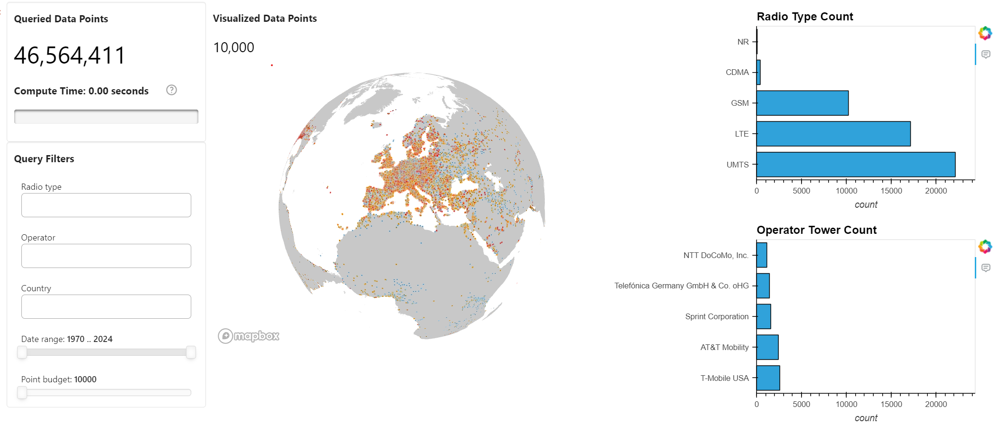

# OpenCellID Data Exploration with Pandas

[OpenCellID](https://wiki.opencellid.org/wiki/What_is_OpenCellID) is the world's largest collaborative community project that collects GPS positions of cell towers, used free of charge, for a multitude of commercial and private purposes.

The OpenCellID project was primarily created to serve as a data source for GSM localisation. As of October, 2017, the database contained almost 36 million unique GSM Cell IDs. More than 75,000 contributors have already registered with OpenCellID, contributing millions of new measurements every day in average to the OpenCellID database.

OpenCellID provides 100% free Cell ID data under a [Creative Commons Attribution-ShareAlike 4.0 International License](https://creativecommons.org/licenses/by-sa/4.0/). The OpenCellID database is published under an open content license with the intention of promoting free use and redistribution of the data. All data uploaded by any of the contributors can also be downloaded again free of charge - no exceptions!

 [OpenCelliD Project](https://opencellid.org/) is licensed under a [Creative Commons Attribution-ShareAlike 4.0 International License](https://creativecommons.org/licenses/by-sa/4.0/)

## Dependencies

- cudf (24.04+)
- pandas (2.2.2)
- pydeck (0.9.1+)
- panel (1.4.2)
- hvplot (0.10.0+)

## Data

1. Cell-data (https://www.opencellid.org/)
   Needs an API key to download the dataset

2. MCC-MNC dataset to map to carrier name
   Publicaly available dataset: https://mcc-mnc.net/ powered by [simbase](https://www.simbase.com/)
